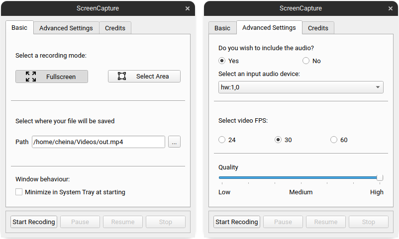

# Screen Recorder QT
Project for the PDS course at the "Politecnico di Torino"

### Group

- Francesco Cheinasso
- Alessandra Comparetto
- Alessandro Cannarella

## Description

This is a screen capture yadayadayada ......

## Linux

### How to run

- Download the latest binary from this [link](https://github.com/cheina97/PDS_Project/releases/latest/download/ScreenRecorder_linux_amd64)
- Install the required libraries with `sudo apt install ffmpeg qt5-default` (Needs QT 5.15 or higher versions)
- Allow the binary execution with `chmod 777 ScreenRecorder_linux_amd64`
- Run the program with `./ScreenRecorder_linux_amd64`

### How to compile and install

- Download the required **Qt libraries** `sudo apt install qt5-qmake qtmultimedia5-dev `
- Download the other required libraries `sudo apt install libasound2-dev libavcodec-dev libavdevice-dev libavfilter-dev libavformat-dev libavutil-dev`
- Install **c++ 20** `sudo apt install gcc-10 gcc-10-base gcc-10-doc g++-10` `sudo apt install libstdc++-10-dev libstdc++-10-doc`
- Clone the repository `git clone https://github.com/cheina97/ScreenRecorderQT.git`
- Go in the project folder  `cd ScreenRecorderQT/ScreenRecorder`
- Generate the **Makefile** `qmake ScreenRecorder.pro`
- Compile it `make clean; make all`
- Allow the **binary** to be executed  `chmod 777 ScreenRecorder`
- Run it `./ScreenRecorder`
- (Optional) Install the **binary** and the  **desktop launcher** in your system `sudo make install`. You can revert this operation with `sudo make uninstall`. The **binary** will be installed in **/opt/ScreenRecorder/ScreenRecorder** and the **desktop launcher** in **/usr/share/applications/ScreenRecorder**.

If the application return an error related to the video device when you start the recording it could be caused by the **DISPLAY** environment variable. Try to  **export** a new **DISPLAY** variable with the command `export DISPLAY=:1`. Sometimes (especially in **VM**) the **DISPLAY** variable contains the screen number  and looks like **:1.0** but this library is expecting a **DISPLAY** variable which look like **:1** (only the **Xserver**) without **screen number**.

In some cases installing **c++ 20** won't be enough to compile the application and the libraries. You will have to add manually **-std=gnu++2a** in the **CXXFLAGS** of the **Makefile ** generated by the **qmake** command.
